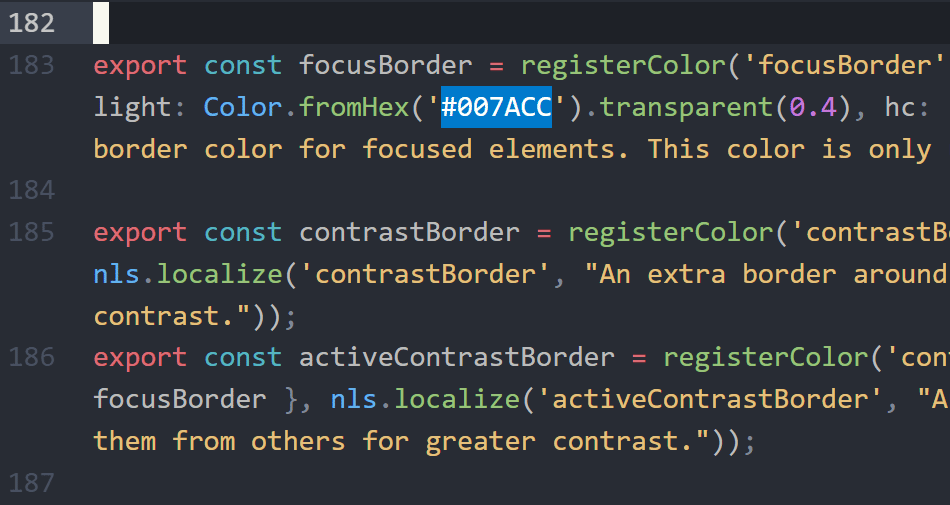

# Highlight logical line

### Please, upvote this feature to be in the core editor: [vscode/36839](https://github.com/microsoft/vscode/issues/36839)

---

Highlights the entire active line:



Color can be changed in `Settings`:

```js
"workbench.colorCustomizations": {
	"highlightLogicalLine.background": "#00000030",
	// also can be changed per each theme
	"[Default Dark+]": {
		"highlightLogicalLine.background": "#ff000020"
	}
}
```

Recommended Settings:
```js
"editor.renderLineHighlight": "gutter",
```

It is also recommended to use transparent colors:

- ❌ `#000000`
- ✅ `#00000088`
